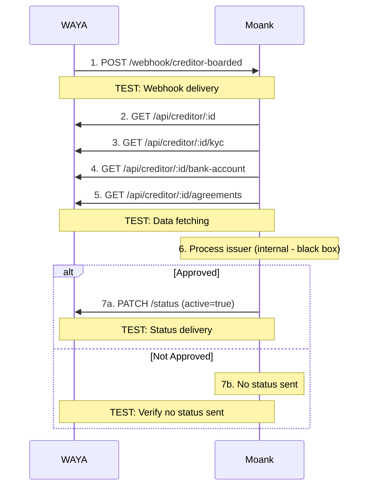

# 🔗 WAYA Integration - Live Testing Checklist

[](https://github.com)
[](https://github.com)
[](https://github.com)
[](https://github.com)

**Document Version:** 1.0  
**Date:** 2026-02-20  
**Test Type:** End-to-End Integration Testing (Live Environment)  
**Participants:** Moank Team + WAYA Team

---

> [!IMPORTANT]
> This document focuses **EXCLUSIVELY** on testing the integration/communication between WAYA and Moank systems. 
> Internal Moank decision rules, checks, and business logic are tested separately in [ISSUER_ONBOARDING_QA_CHECKLIST.md](./ISSUER_ONBOARDING_QA_CHECKLIST.md).

---

## 📋 Table of Contents

- [What Is Tested](#-what-is-tested-in-this-document)
- [What Is NOT Tested](#-what-is-not-tested-here)
- [Overview](#-overview)
- [Test Environment Setup](#-test-environment-setup)
- [Test Scenarios](#-test-scenarios)
  - [Section 1: Happy Path - Approved Issuer](#section-1-happy-path---approved-issuer)
  - [Section 2: Denied/Not Approved](#section-2-deniednotapproved-scenario)
  - [Section 3: Data Update & Re-evaluation](#section-3-pending-review---data-update--re-evaluation)
  - [Section 4: Manual Deactivation](#section-4-manual-deactivation---status-synchronization)
  - [Section 5: Error Handling](#section-5-error-handling---integration-issues)
  - [Section 6: Data Synchronization](#section-6-data-synchronization-tests)
  - [Section 7: Performance](#section-7-integration-response-time--performance)
  - [Section 8: Data Validation](#section-8-data-validation-between-systems)
  - [Section 9: Negative Tests](#section-9-integration-negative-tests)
  - [Section 10: Idempotency](#section-10-duplicate-prevention--idempotency)
- [Test Execution Plan](#-test-execution-plan)
- [Test Data](#-test-data-preparation)
- [Success Criteria](#-success-criteria)
- [Tools & Commands](#-tools--commands-for-integration-testing)
- [API Examples](#-api-requestresponse-examples)

---

## ✅ What Is Tested in This Document

- ✓ **Webhook delivery** (WAYA → Moank)
- ✓ **API calls for data fetching** (Moank → WAYA: creditor, KYC, bank account, agreements)
- ✓ **Status updates** (Moank → WAYA: active=true/false)
- ✓ **Data synchronization** between systems
- ✓ **Error handling** (retries, timeouts, authentication failures)
- ✓ **Idempotency** and duplicate prevention
- ✓ **Performance** (API response times, end-to-end timing)

## ❌ What Is NOT Tested Here

> [!NOTE]
> The following are tested separately in other test suites:

- ✗ Moank internal decision rules (9 rules: industry code, failure score, KYC, sanctions, etc.)
- ✗ D&B and Creditsafe API integrations
- ✗ Blacklist service checks
- ✗ High-risk flagging and EDD workflows
- ✗ AML Manager checks
- ✗ Moank UI functionality
- ✗ Database schema validation

➡️ See [ISSUER_ONBOARDING_QA_CHECKLIST.md](./ISSUER_ONBOARDING_QA_CHECKLIST.md) for internal Moank testing

---

## 📖 Overview

**Purpose:** Test integration/communication between Moank IF system and WAYA systems  
**Scope:** Webhook delivery, API data exchange, status synchronization, error handling  
**Focus:** INTEGRATION ONLY - Communication layer between two systems

### Integration Flow (Communication Between Systems)



**Numbered Steps:**
1. WAYA creates issuer/creditor in their system
2. WAYA sends boarding event/webhook to Moank → **TEST: Webhook delivery**
3. Moank receives webhook and fetches issuer data from WAYA APIs → **TEST: Data fetching**
4. Moank processes issuer (internal logic - **BLACK BOX** for this test)
5. If approved: Moank sends status update to WAYA (active = true) → **TEST: Status delivery**
6. If not approved: Moank does NOT send status → **TEST: Verify no status sent**
7. WAYA receives status and updates → **TEST: Status synchronization**

### 🎯 Key Testing Points

- 📤 Webhook delivery (WAYA → Moank)
- 📥 API calls for data fetching (Moank → WAYA)
- 🔄 Status updates (Moank → WAYA)
- ⚠️ Error handling and retries
- 🔁 Idempotency
- ⚡ Performance/timing

[↑ Back to top](#-waya-integration---live-testing-checklist)


---

## 🔧 Test Environment Setup

### Pre-Test Checklist

- [ ] WAYA test environment URL `[WAYA Team]`
- [ ] Moank staging environment running `[Moank Team]`
- [ ] API authentication configured (both sides) `[Both Teams]`
- [ ] Webhook endpoints configured `[Both Teams]`
- [ ] Test credentials exchanged `[Both Teams]`
- [ ] Kafka topics accessible `[Moank Team]`
- [ ] Database access for verification `[Moank Team]`
- [ ] Third-party services available (D&B, Creditsafe) `[Moank Team]`
- [ ] Test data prepared (org numbers, IBANs) `[Both Teams]`
- [ ] Communication channel open (Slack/Teams) `[Both Teams]`
- [ ] **⚠️ CRITICAL: Understand Moank sends ONLY active/inactive flag** `[Both Teams]` — **NO denial reasons sent**

### API Endpoints to Test

| Direction | Method | Endpoint | Owner |
|-----------|--------|----------|-------|
| WAYA → Moank | `POST` | `/api/v1/webhook/creditor-boarded` | Moank receives |
| Moank → WAYA | `GET` | `/api/creditor/:creditorId` | Moank calls |
| Moank → WAYA | `GET` | `/api/creditor/:creditorId/kyc` | Moank calls |
| Moank → WAYA | `GET` | `/api/creditor/:creditorId/bank-account` | Moank calls |
| Moank → WAYA | `GET` | `/api/creditor/:creditorId/agreements` | Moank calls |
| Moank → WAYA | `PATCH` | `/api/creditor/:creditorId/status` | Moank sends status (`active` flag only) |

[↑ Back to top](#-waya-integration---live-testing-checklist)

---

## 🧪 Test Scenarios

### Section 1: Happy Path - Approved Issuer

**Test Scenario:** WAYA creates valid issuer, Moank approves and activates  
**Expected Outcome:** Issuer becomes ACTIVE in both systems

- [ ] **1.1** Create issuer in WAYA `[WAYA Team]`  
  → WAYA UI/API: Create creditor with valid org# (e.g., 556677889), country = SE, complete KYC data

- [ ] **1.2** Verify issuer created in WAYA `[WAYA Team]`  
  → WAYA shows: creditorId generated, status = "PENDING_APPROVAL", all data saved

- [ ] **1.3** WAYA sends webhook to Moank `[WAYA System]`  
  → POST to Moank /webhook/creditor-boarded with: creditorId, organisationNumber, country, timestamp

- [ ] **1.4** Verify webhook received `[Both Teams]`  
  → Moank logs: "Webhook received: creditorId = ...", HTTP 200 response sent to WAYA

- [ ] **1.5** Verify Moank fetches issuer data `[Both Teams]`  
  → GET /api/creditor/:creditorId → WAYA logs show request received, returns: name, org#, country, address

- [ ] **1.6** Verify Moank fetches KYC data `[Both Teams]`  
  → GET /api/creditor/:creditorId/kyc → WAYA returns beneficial owners data

- [ ] **1.7** Verify Moank fetches bank account `[Both Teams]`  
  → GET /api/creditor/:creditorId/bank-account → WAYA returns IBAN, bank name

- [ ] **1.8** Verify Moank fetches agreements `[Both Teams]`  
  → GET /api/creditor/:creditorId/agreements → WAYA returns signed agreement data

- [ ] **1.9** Moank processes issuer `[Moank Team]`  
  → Moank evaluates issuer (internal checks - see [ISSUER_ONBOARDING_QA_CHECKLIST.md](./ISSUER_ONBOARDING_QA_CHECKLIST.md))

- [ ] **1.10** Moank issuer becomes ACTIVE `[Moank Team]`  
  → Query Moank database: `aggregatedStatus = 'ACTIVE'`

- [ ] **1.11** Moank sends status update to WAYA `[Moank System]`  
  → PATCH /api/creditor/:creditorId/status with: `active = true`

- [ ] **1.12** WAYA receives status update `[WAYA Team]`  
  → WAYA logs show status update received, HTTP 200 response sent

- [ ] **1.13** WAYA updates issuer to ACTIVE `[WAYA Team]`  
  → WAYA database/UI shows: creditor status = "ACTIVE"

- [ ] **1.14** Verify status synchronized `[Both Teams]`  
  → Moank query: status = ACTIVE, WAYA query: status = ACTIVE

- [ ] **1.15** Test invoice creation ready `[Both Teams]`  
  → WAYA UI shows issuer as active and ready for invoicing


#### Expected Integration Results

- ✅ Webhook delivery successful (WAYA → Moank)
- ✅ All data fetching API calls successful (Moank → WAYA)
- ✅ Status update sent successfully (Moank → WAYA with `active=true`)
- ✅ Status synchronized: Moank ACTIVE, WAYA ACTIVE
- ✅ All API calls logged in both systems
- ✅ Total integration time: < 30 seconds from webhook to status update

[↑ Back to top](#-waya-integration---live-testing-checklist)

---

### Section 2: Denied/Not Approved Scenario

**Test Scenario:** WAYA creates issuer, Moank does NOT approve (stays inactive)  
**Expected Outcome:** Issuer remains NOT ACTIVE, no status update sent to WAYA

- [ ] **2.1** Create issuer with problematic data `[WAYA Team]`  
  → WAYA: Create creditor with data that will be denied by Moank (e.g., denied industry)

- [ ] **2.2** Verify issuer created in WAYA `[WAYA Team]`  
  → WAYA shows: creditorId generated, status = "PENDING_APPROVAL"

- [ ] **2.3** WAYA sends webhook to Moank `[WAYA System]`  
  → POST to Moank /webhook/creditor-boarded

- [ ] **2.4** Verify webhook received `[Both Teams]`  
  → Moank logs webhook received, HTTP 200 sent

- [ ] **2.5** Verify Moank fetches all data `[Both Teams]`  
  → WAYA logs show all API requests (issuer, KYC, bank, agreements) received

- [ ] **2.6** Moank processes issuer `[Moank Team]`  
  → Moank evaluates issuer (internal checks result in denial)

- [ ] **2.7** Moank issuer stays INACTIVE `[Moank Team]`  
  → Query Moank database: `aggregatedStatus = 'INACTIVE'`

- [ ] **2.8** Moank does NOT send status to WAYA `[Both Teams]`  
  → No PATCH /status call made to WAYA (verify WAYA logs show no status update)

- [ ] **2.9** WAYA issuer remains in pending state `[WAYA Team]`  
  → WAYA status still "PENDING_APPROVAL" (never activated)

- [ ] **2.10** Verify no active flag sent `[Both Teams]`  
  → WAYA API logs: No status update received from Moank

- [ ] **2.11** WAYA cannot activate invoice creation `[WAYA Team]`  
  → WAYA UI: Issuer not shown as active, invoicing not enabled


#### Expected Integration Results

- ✅ Webhook delivery successful (WAYA → Moank)
- ✅ Data fetching successful (Moank → WAYA)
- ✅ **NO status update sent to WAYA** (verified in logs)
- ✅ WAYA issuer remains in PENDING_APPROVAL state
- ✅ Integration behaves correctly: no activation when not approved
- ✅ No detailed denial reasons communicated (by design - integration works as specified)

[↑ Back to top](#-waya-integration---live-testing-checklist)

---

### Section 3: Pending Review - Data Update & Re-evaluation

**Test Scenario:** Issuer initially incomplete, data updated, then approved  
**Expected Outcome:** After data update and Moank approval, issuer becomes ACTIVE

- [ ] **3.1** Create issuer with incomplete data `[WAYA Team]`  
  → WAYA: Create creditor with incomplete KYC data (e.g., missing beneficial owners)

- [ ] **3.2** WAYA sends webhook `[WAYA System]`  
  → POST to Moank /webhook/creditor-boarded

- [ ] **3.3** Verify webhook and data fetching `[Both Teams]`  
  → Moank receives webhook, fetches all data from WAYA APIs

- [ ] **3.4** Moank processes issuer `[Moank Team]`  
  → Moank evaluation identifies incomplete data

- [ ] **3.5** Moank issuer status = NEED_ACTION `[Moank Team]`  
  → Query Moank: `aggregatedStatus = 'NEED_ACTION'` (awaiting data or manual review)

- [ ] **3.6** Moank does NOT send status to WAYA `[Both Teams]`  
  → No status update sent (verify WAYA logs)

- [ ] **3.7** WAYA issuer remains pending `[WAYA Team]`  
  → WAYA status still "PENDING_APPROVAL"

- [ ] **3.8** WAYA updates issuer data `[WAYA Team]`  
  → WAYA: Complete missing data (add beneficial owners)

- [ ] **3.9** WAYA triggers re-evaluation `[WAYA System]`  
  → Send webhook /creditor-updated OR Moank polls for updates

- [ ] **3.10** Moank re-fetches updated data `[Moank System]`  
  → GET /api/creditor/:creditorId/kyc → WAYA returns complete data

- [ ] **3.11** Moank re-evaluates issuer `[Moank Team]`  
  → Moank processes with updated data (may require manual approval)

- [ ] **3.12** Moank operator approves manually `[Moank Team]`  
  → If needed: Moank UI → Manual approval → Status changes to ACTIVE

- [ ] **3.13** Moank sends status update to WAYA `[Moank System]`  
  → PATCH /api/creditor/:creditorId/status with: `active = true`

- [ ] **3.14** WAYA receives status update `[WAYA Team]`  
  → WAYA logs show status update received

- [ ] **3.15** WAYA updates to ACTIVE `[WAYA Team]`  
  → WAYA status = "ACTIVE", issuer can now create invoices

- [ ] **3.16** Verify status synchronized `[Both Teams]`  
  → Moank: ACTIVE, WAYA: ACTIVE


#### Expected Integration Results

- ⚠️ Initial: NO status sent to WAYA, WAYA remains PENDING
- ✅ Data update notification delivered (WAYA → Moank)
- ✅ Moank re-fetches updated data successfully
- ✅ After approval: Status update sent (Moank → WAYA with `active=true`)
- ✅ Status synchronized after resolution
- ✅ Complete integration cycle works: webhook → fetch → update → re-fetch → status

[↑ Back to top](#-waya-integration---live-testing-checklist)

---

### Section 4: Manual Deactivation - Status Synchronization

**Test Scenario:** Active issuer is manually deactivated in Moank  
**Expected Outcome:** Inactive status flag sent to WAYA, both systems synchronized

- [ ] **4.1** Start with ACTIVE issuer `[Both Teams]`  
  → Prerequisite: Issuer already ACTIVE in both Moank and WAYA

- [ ] **4.2** Verify initial state `[Both Teams]`  
  → Moank: status = ACTIVE, WAYA: status = ACTIVE

- [ ] **4.3** Moank operator deactivates issuer `[Moank Team]`  
  → Moank UI: Select issuer → Click "Deactivate" → Confirm

- [ ] **4.4** Moank issuer becomes INACTIVE `[Moank Team]`  
  → Query Moank: `aggregatedStatus = 'INACTIVE'`

- [ ] **4.5** Moank sends status update to WAYA `[Moank System]`  
  → PATCH /api/creditor/:creditorId/status with: `active = false`

- [ ] **4.6** WAYA receives status update `[WAYA Team]`  
  → WAYA logs show status update received with `active = false`

- [ ] **4.7** WAYA updates issuer to INACTIVE `[WAYA Team]`  
  → WAYA status = "INACTIVE" or "DEACTIVATED"

- [ ] **4.8** Verify status synchronized `[Both Teams]`  
  → Moank: INACTIVE, WAYA: INACTIVE/DEACTIVATED

- [ ] **4.9** WAYA blocks invoice creation `[WAYA Team]`  
  → WAYA UI: Invoice creation disabled for this issuer


#### Expected Integration Results

- ✅ Status update sent successfully (Moank → WAYA with `active=false`)
- ✅ WAYA received status update (verified in logs)
- ✅ WAYA processed update and changed status to INACTIVE
- ✅ Both systems synchronized (Moank INACTIVE, WAYA INACTIVE)
- ✅ Integration works bidirectionally: can send both `active=true` and `active=false`
- ✅ No detailed reason sent (by design - integration behavior correct)

[↑ Back to top](#-waya-integration---live-testing-checklist)

---

### Section 5: Error Handling - Integration Issues

#### 5.1 WAYA API Returns 500 Error

- [ ] **5.1** Create issuer in WAYA `[WAYA Team]` → Create creditor normally
- [ ] **5.2** WAYA sends webhook `[WAYA System]` → POST to Moank /webhook/creditor-boarded → Moank receives
- [ ] **5.3** Simulate WAYA API error `[WAYA Team]` → WAYA API configured to return HTTP 500 for test
- [ ] **5.4** Moank attempts to fetch data `[Moank System]` → GET /api/creditor/:creditorId → WAYA returns HTTP 500
- [ ] **5.5** Verify Moank logs error `[Moank Team]` → Moank logs: "WAYA API error: HTTP 500"
- [ ] **5.6** Verify Moank retry mechanism `[Moank Team]` → Moank retries with exponential backoff (verify retry attempts in logs)
- [ ] **5.7** Verify no status sent to WAYA `[Both Teams]` → No PATCH /status call made (unable to complete evaluation)
- [ ] **5.8** Verify alert generated `[Moank Team]` → Slack/Email alert: "WAYA API error for creditor ..."
- [ ] **5.9** WAYA Team fixes API issue `[WAYA Team]` → Restore WAYA API to normal operation
- [ ] **5.10** Moank retries successfully `[Moank Team]` → Manually trigger re-evaluation → Data fetch succeeds
- [ ] **5.11** Verify status eventually sent `[Both Teams]` → After successful evaluation: PATCH /status sent to WAYA


#### 5.2 WAYA API Authentication Failure

- [ ] **5.21** Simulate authentication issue `[WAYA Team]` → WAYA API configured to return HTTP 401
- [ ] **5.22** Moank attempts to fetch data `[Moank System]` → GET request → WAYA returns: HTTP 401 "Unauthorized"
- [ ] **5.23** Verify Moank logs authentication error `[Moank Team]` → Moank logs: "WAYA API authentication failed: 401"
- [ ] **5.24** Verify Moank token refresh attempt `[Moank Team]` → Moank requests new JWT token and retries
- [ ] **5.25** WAYA Team fixes authentication `[WAYA Team]` → Restore correct authentication configuration
- [ ] **5.26** Moank retry succeeds `[Both Teams]` → Moank successfully fetches data with refreshed token


#### 5.3 Webhook Delivery Failure

- [ ] **5.31** Simulate Moank webhook endpoint down `[Moank Team]` → Stop Moank webhook service temporarily
- [ ] **5.32** WAYA attempts to send webhook `[WAYA System]` → POST to Moank /webhook/creditor-boarded → Connection timeout or 503
- [ ] **5.33** Verify WAYA logs webhook failure `[WAYA Team]` → WAYA logs: "Webhook delivery failed to Moank"
- [ ] **5.34** Verify WAYA retry mechanism `[WAYA Team]` → WAYA retry logic: attempts webhook delivery multiple times with delays
- [ ] **5.35** Moank service restored `[Moank Team]` → Restart Moank webhook service
- [ ] **5.36** WAYA retry succeeds `[Both Teams]` → WAYA logs: "Webhook delivered successfully", Moank logs: "Webhook received"
- [ ] **5.37** Verify idempotency `[Moank Team]` → If duplicate webhooks → Only process once (check eventId)

[↑ Back to top](#-waya-integration---live-testing-checklist)


---

### Section 6: Data Synchronization Tests

#### 6.1 Data Update in WAYA - Triggers Re-evaluation

- [ ] **6.1** Start with issuer in any state `[Both Teams]` → Issuer exists in both systems
- [ ] **6.2** WAYA updates issuer data `[WAYA Team]` → Update creditor: change IBAN, update BO, change address, etc.
- [ ] **6.3** WAYA sends update notification `[WAYA System]` → POST /webhook/creditor-updated OR Moank polls for changes
- [ ] **6.4** Verify Moank receives notification `[Moank Team]` → Moank logs: "Data update notification received for creditor ..."
- [ ] **6.5** Moank re-fetches updated data `[Moank System]` → GET /api/creditor/:creditorId, /kyc, /bank-account → WAYA returns updated data
- [ ] **6.6** Verify WAYA API calls logged `[WAYA Team]` → WAYA logs show all re-fetch requests from Moank
- [ ] **6.7** Moank re-evaluates issuer `[Moank Team]` → Moank processes issuer with updated data
- [ ] **6.8** If status changes, Moank sends update `[Moank System]` → PATCH /api/creditor/:creditorId/status (only if status actually changes)
- [ ] **6.9** Verify status synchronized `[Both Teams]` → If status changed: both systems reflect new status


---

### Section 7: Integration Response Time & Performance

#### Performance Benchmarks

- [ ] **PR001** Webhook response time (WAYA→Moank) `Target: < 500ms`  
  → Moank receives webhook → HTTP 200 response within 500ms | **Actual:** _____

- [ ] **PR002** WAYA API response time (Moank fetches) `Target: < 1s`  
  → GET /api/creditor/:id → WAYA responds in < 1000ms | **Actual:** _____

- [ ] **PR003** End-to-end onboarding time (happy path) `Target: < 30s`  
  → From WAYA webhook to Moank sends `active=true` to WAYA | **Actual:** _____

- [ ] **PR004** Status update response (Moank→WAYA) `Target: < 2s`  
  → PATCH /status → WAYA responds HTTP 200 within 2s | **Actual:** _____

- [ ] **PR005** Data re-fetch after update notification `Target: < 5s`  
  → From update webhook to all data re-fetched from WAYA | **Actual:** _____


---

### Section 8: Data Validation Between Systems

#### 8.1 Verify Data Consistency

- [ ] **DV001** Organisation Number → Same org# in both systems  
  **Moank:** _____ | **WAYA:** _____

- [ ] **DV002** Country Code → Same country code (SE/NO/DK/FI)  
  **Moank:** _____ | **WAYA:** _____

- [ ] **DV003** Company Name → Same company name (handle special chars)  
  **Moank:** _____ | **WAYA:** _____

- [ ] **DV004** IBAN → Same IBAN (without spaces)  
  **Moank:** _____ | **WAYA:** _____

- [ ] **DV005** Bank Name → Same bank name  
  **Moank:** _____ | **WAYA:** _____

- [ ] **DV006** Number of BOs → Same count of beneficial owners  
  **Moank:** _____ | **WAYA:** _____

- [ ] **DV007** BO Names → All BO names match  
  **Moank:** _____ | **WAYA:** _____

- [ ] **DV008** BO Ownership % → Ownership percentages match  
  **Moank:** _____ | **WAYA:** _____

- [ ] **DV009** Agreement ID → Same agreement reference  
  **Moank:** _____ | **WAYA:** _____

- [ ] **DV010** Creditor/Issuer ID → WAYA creditorId stored in Moank  
  **Moank:** _____ | **WAYA:** _____


#### 8.2 Status Synchronization Check

- [ ] **SY001** Approved issuer  
  **Moank:** ACTIVE | **WAYA:** ACTIVE | **Sent:** `active=true`

- [ ] **SY002** Denied issuer (not approved)  
  **Moank:** INACTIVE | **WAYA:** PENDING_APPROVAL | **Sent:** NOT sent  
  _Note: WAYA never receives activation_

- [ ] **SY003** Pending review  
  **Moank:** NEED_ACTION | **WAYA:** PENDING_APPROVAL | **Sent:** NOT sent  
  _Note: Awaiting Moank decision_

- [ ] **SY004** Awaiting manual approval  
  **Moank:** AWAITING_ACTIVATION | **WAYA:** PENDING_APPROVAL | **Sent:** NOT sent

- [ ] **SY005** Manually deactivated  
  **Moank:** INACTIVE | **WAYA:** INACTIVE/DEACTIVATED | **Sent:** `active=false`  
  _Note: Was active, then deactivated_

[↑ Back to top](#-waya-integration---live-testing-checklist)


---

### Section 9: Integration Negative Tests

#### 9.1 Invalid Webhook Payload

- [ ] **ER001** Webhook with missing creditorId → Moank returns HTTP 422, error: "creditorId is required"
- [ ] **ER002** Webhook with invalid creditorId format → Moank returns HTTP 422, error: "Invalid creditorId format"
- [ ] **ER003** Webhook with missing organisationNumber → Moank returns HTTP 422, validation error
- [ ] **ER004** Webhook with invalid country code → Moank returns HTTP 422, error: "Invalid country code"
- [ ] **ER005** Webhook without authentication → Moank returns HTTP 401
- [ ] **ER006** Webhook with expired token → Moank returns HTTP 401, error: "Token expired"


#### 9.2 WAYA API Returns Invalid/Incomplete Data

- [ ] **ER101** WAYA returns malformed JSON → Moank logs error, evaluation cannot complete
- [ ] **ER102** WAYA returns null IBAN → Moank handles missing data
- [ ] **ER103** WAYA returns BO with missing DOB → Moank handles incomplete data
- [ ] **ER104** WAYA returns empty BO array → Moank handles missing KYC
- [ ] **ER105** WAYA agreement not signed → Moank handles unsigned agreement


#### 9.3 Network & Timeout Issues

- [ ] **ER201** WAYA API slow response (> 30s) → Moank timeout, logs error, evaluation cannot complete
- [ ] **ER202** Network disconnect during fetch → Moank handles gracefully, retries when network restored
- [ ] **ER203** WAYA temporarily unavailable (503) → Moank retries with backoff

[↑ Back to top](#-waya-integration---live-testing-checklist)


---

### Section 10: Duplicate Prevention & Idempotency

- [ ] **ID001** Duplicate webhook with same eventId → First processed, second ignored with log: "Duplicate event"
- [ ] **ID002** Create same issuer twice → WAYA sends 2 webhooks for same org# + country → Second returns HTTP 409 or is ignored
- [ ] **ID003** Retry failed webhook (same eventId) → Webhook fails first time, WAYA retries with same eventId → Should process successfully (idempotent)
- [ ] **ID004** Status update already sent → Moank sends status update to WAYA twice → WAYA handles gracefully, no duplicate processing

[↑ Back to top](#-waya-integration---live-testing-checklist)

---

## 📅 Test Execution Plan

### Pre-Test Communication Template

```
Subject: Live Integration Testing - WAYA & Moank IF
To: WAYA Team
From: Moank QA Team

Hi WAYA Team,

We are ready to start live integration testing for issuer onboarding.

**Test Environment:**
- Moank Staging: https://staging.moank-if.com
- Moank Webhook Endpoint: https://staging.moank-if.com/api/v1/webhook/creditor-boarded
- Authentication: JWT Bearer token (shared separately)

**Test Scenarios:**
1. Happy path: Issuer approved and activated (org# 556677889, country SE)
2. Not approved: Issuer not activated, no status sent (org# [to be provided])
3. Data update: Re-evaluation after WAYA updates data
4. Manual deactivation: Status synchronization test
5. Error handling: API failures, webhook retries, timeouts

**Communication:**
- Slack channel: #integration-testing-waya
- Point of contact: [Your Name] - [Email] - [Phone]

**Schedule:**
- Date: [Date]
- Time: 10:00-14:00 CET
- Meeting link: [Teams/Zoom link]

Please confirm:
- Your test environment is ready
- You can create test creditors
- You can send webhooks to our endpoint
- You have our API endpoints documented

Looking forward to successful testing!

Best regards,
[Your Name]
Moank QA Team
```

[↑ Back to top](#-waya-integration---live-testing-checklist)

---

## 📊 Test Data Preparation

### Test Issuers to Create

| Test # | Purpose | Org Number | Country | Expected Moank Action | Expected WAYA Status | Notes |
|--------|---------|------------|---------|----------------------|---------------------|-------|
| 1 | Happy path | 556677889 | SE | Sends `active=true` | ACTIVE | Complete valid data |
| 2 | Not approved | 556688990 | SE | NO status sent | PENDING_APPROVAL | Will not pass Moank checks |
| 3 | Incomplete data | 556700112 | DK | NO status sent | PENDING_APPROVAL | Missing KYC initially |
| 4 | Data update test | 556700112 | DK | After update: `active=true` | ACTIVE | Same as #3, after data completed |
| 5 | Manual deactivation | 556677889 | SE | Sends `active=false` | INACTIVE | Start with active (#1), then deactivate |


### Checklist for Each Test

**Before Each Test:**
- [ ] Clear previous test data from databases (both systems)
- [ ] Verify services are running (Moank, WAYA APIs)
- [ ] Open log monitoring (both systems)
- [ ] Prepare screen sharing for collaboration
- [ ] Have database/log access ready

**During Each Test:**
- [ ] WAYA Team: Create issuer in WAYA system
- [ ] WAYA Team: Confirm webhook sent successfully
- [ ] Moank Team: Verify webhook received in logs
- [ ] Both Teams: Monitor API calls (data fetching)
- [ ] Moank Team: Monitor processing (without detailing internal rules)
- [ ] Both Teams: Watch for status update call (Moank→WAYA)
- [ ] Both Teams: Verify logs in real-time
- [ ] Both Teams: Check database status in both systems

**After Each Test:**
- [ ] Record results (Pass/Fail)
- [ ] Screenshot any errors or unexpected behavior
- [ ] Save logs from both systems
- [ ] Document timing/performance metrics
- [ ] Note any API failures or retries

[↑ Back to top](#-waya-integration---live-testing-checklist)


---

## ✅ Success Criteria

### Mandatory Pass Criteria

> [!IMPORTANT]
> All criteria below are **required for production deployment** (100% pass rate)

- [ ] Happy path works end-to-end
- [ ] Webhook delivery (WAYA→Moank) successful
- [ ] Data fetching (Moank→WAYA) works
- [ ] Status update (Moank→WAYA) successful
- [ ] Denied scenario: no status sent to WAYA
- [ ] Pending review scenario works
- [ ] Manual deactivation synchronizes correctly
- [ ] Status synchronized between systems
- [ ] Error handling works (retries, logging)
- [ ] Idempotency verified


### Optional Pass Criteria

> [!NOTE]
> These criteria are **recommended but not blocking** for production

- [ ] Performance meets targets (< 30s end-to-end)
- [ ] Authentication refresh works
- [ ] Network failure recovery works

[↑ Back to top](#-waya-integration---live-testing-checklist)


---

## 🐛 Issues & Bugs Tracking

### Integration Issues Log

| Issue # | Severity | Component | Description | Found By | Status | Resolution |
|---------|----------|-----------|-------------|----------|--------|------------|
| INT-001 | | | | | 🔴 Open | |
| INT-002 | | | | | 🔴 Open | |
| INT-003 | | | | | 🔴 Open | |


**Severity Definitions:**
- 🔴 **Critical:** Integration doesn't work, blocking
- 🟠 **High:** Major functionality broken, workaround exists
- 🟡 **Medium:** Minor issue, doesn't block testing
- 🟢 **Low:** Cosmetic, improvement suggestion

[↑ Back to top](#-waya-integration---live-testing-checklist)


---

## 📋 Post-Testing Actions

### Immediate Actions

- [ ] Document all test results `[Moank QA]` — Due: Same day
- [ ] Share test report with WAYA team `[Moank QA]` — Due: Same day
- [ ] Log all bugs in issue tracker `[Moank Dev]` — Due: Same day
- [ ] Update API documentation with findings `[Moank Dev]` — Due: Next day
- [ ] Schedule retest for failed scenarios `[Both Teams]` — Due: TBD


### Follow-Up Actions

- [ ] Fix critical bugs `[Responsible Dev]` — Due: 2 days
- [ ] Fix high priority bugs `[Responsible Dev]` — Due: 1 week
- [ ] Implement agreed improvements `[Both Teams]` — Due: 2 weeks
- [ ] Conduct regression testing `[Moank QA]` — Due: After fixes
- [ ] Plan production deployment `[Both Teams]` — Due: TBD

[↑ Back to top](#-waya-integration---live-testing-checklist)


---

## ✍️ Sign-Off for Live Integration Testing

### Moank Team Sign-Off

**QA Lead**  
Name: _______________________  
Signature: __________________  
Date: _______________________  
Result: [ ] Approved / [ ] Rejected / [ ] Conditional

**Development Lead**  
Name: _______________________  
Signature: __________________  
Date: _______________________  
Result: [ ] Approved / [ ] Rejected / [ ] Conditional

### WAYA Team Sign-Off

**Integration Lead**  
Name: _______________________  
Signature: __________________  
Date: _______________________  
Result: [ ] Approved / [ ] Rejected / [ ] Conditional

**QA Lead**  
Name: _______________________  
Signature: __________________  
Date: _______________________  
Result: [ ] Approved / [ ] Rejected / [ ] Conditional

### Conditions for Production Deployment (if any)

1. _______________________________________________
2. _______________________________________________
3. _______________________________________________

[↑ Back to top](#-waya-integration---live-testing-checklist)

---

## 📞 Contact Information

### Moank Team

- **QA Lead:** [Name] - [Email] - [Phone]
- **Dev Lead:** [Name] - [Email] - [Phone]
- **On-Call:** [Name] - [Phone]

### WAYA Team

- **Integration Lead:** [Name] - [Email] - [Phone]
- **QA Lead:** [Name] - [Email] - [Phone]
- **On-Call:** [Name] - [Phone]

### Emergency Escalation

> [!WARNING]
> **If critical issue during testing:**
> 1. Stop testing immediately
> 2. Notify both team leads
> 3. Document issue with logs
> 4. Schedule emergency meeting


---

## 📚 API Request/Response Examples

### A. WAYA → Moank Webhook

**Request:**

```http
POST https://staging.moank-if.com/api/v1/webhook/creditor-boarded
Authorization: Bearer <JWT_TOKEN>
Content-Type: application/json

{
  "eventId": "evt_123456789",
  "eventType": "CREDITOR_BOARDED",
  "timestamp": "2026-02-20T10:30:00Z",
  "creditorId": "cred_abc123",
  "organisationNumber": "556677889",
  "country": "SE",
  "channelId": "channel_moank"
}
```

**Response (Success):**

```http
HTTP 200 OK
{
  "received": true,
  "eventId": "evt_123456789",
  "processingStarted": true
}
```


### B. Moank → WAYA: Fetch Issuer Data

**Request:**

```http
GET https://api.waya.com/api/creditor/cred_abc123
Authorization: Bearer <JWT_TOKEN>
```

Response:
```
HTTP 200 OK
{
  "creditorId": "cred_abc123",
  "organisationNumber": "556677889",
  "country": "SE",
  "name": "Test Company AB",
  "address": {
    "street": "Testgatan 1",
    "city": "Stockholm",
    "postalCode": "11122",
    "country": "SE"
  },
  "contactInformation": {
    "email": "contact@testcompany.se",
    "phoneNumber": "+46701234567"
  }
}
```


### C. Moank → WAYA: Fetch KYC Data

**Request:**

```http
GET https://api.waya.com/api/creditor/cred_abc123/kyc
Authorization: Bearer <JWT_TOKEN>
```

Response:
```
HTTP 200 OK
{
  "beneficialOwners": [
    {
      "id": "bo_001",
      "name": "John Doe",
      "dateOfBirth": "1980-05-15",
      "citizenship": "SE",
      "taxResidence": "SE",
      "ownershipPercentage": 60,
      "address": {
        "street": "Ägargatan 10",
        "city": "Stockholm",
        "postalCode": "11133",
        "country": "SE"
      }
    },
    {
      "id": "bo_002",
      "name": "Jane Smith",
      "dateOfBirth": "1985-08-22",
      "citizenship": "NO",
      "taxResidence": "NO",
      "ownershipPercentage": 40,
      "address": {
        "street": "Eiergaten 5",
        "city": "Oslo",
        "postalCode": "0152",
        "country": "NO"
      }
    }
  ],
  "businessFinancingMethod": "Invoice financing",
  "purposeOfCollaboration": "Working capital management",
  "expectedMonthlyFinancing": 500000
}
```


### D. Moank → WAYA: Send Status Update (ACTIVE)

> [!NOTE]
> Moank ONLY sends active/inactive status flag to WAYA. NO detailed decision reasons, NO rule results, NO denied/granted details.

**Request:**

```http
PATCH https://api.waya.com/api/creditor/cred_abc123/status
Authorization: Bearer <JWT_TOKEN>
Content-Type: application/json

{
  "active": true,
  "updatedAt": "2026-02-20T10:35:00Z"
}
```

Response:
```
HTTP 200 OK
{
  "creditorId": "cred_abc123",
  "statusUpdated": true,
  "active": true
}
```


### E. Moank → WAYA: Send Status Update (INACTIVE)

> [!NOTE]
> When issuer is deactivated in Moank (manually or via re-evaluation), only the inactive flag is sent. NO reasons provided.

**Request:**

```http
PATCH https://api.waya.com/api/creditor/cred_abc123/status
Authorization: Bearer <JWT_TOKEN>
Content-Type: application/json

{
  "active": false,
  "updatedAt": "2026-02-20T11:45:00Z"
}
```

Response:
```
HTTP 200 OK
{
  "creditorId": "cred_abc123",
  "statusUpdated": true,
  "active": false
}
```


### F. IMPORTANT: What Moank Does NOT Send to WAYA

> [!WARNING]
> The following information is kept **INTERNAL** to Moank and is **NOT sent to WAYA**:

- ❌ Decision reasons (why approved/denied/referred)
- ❌ Individual rule results (GRANTED, DENIED, REFERRED)
- ❌ High-risk flags (PEP, sanction, blacklist)
- ❌ EDD completion status
- ❌ Failure scores
- ❌ Industry codes
- ❌ D&B or Creditsafe results
- ❌ Any detailed explanation of decision logic

**WAYA only receives:** `active = true` or `active = false`

[↑ Back to top](#-waya-integration---live-testing-checklist)

---

## 🛠️ Tools & Commands for Integration Testing

### Monitor Webhook Delivery (WAYA → Moank)
```bash
# Moank Team: Check webhook received
tail -f logs/waya-integration.log | grep "webhook.*creditor-boarded"

# WAYA Team: Check webhook sent
tail -f logs/webhook-delivery.log | grep "moank.*creditor-boarded"

# Moank Team: Query database for issuer created
psql -d moank_db -c "SELECT id, waya_creditor_id, status, created_at FROM issuers WHERE waya_creditor_id = 'cred_abc123';"
```


### Monitor API Data Fetching (Moank → WAYA)
```bash
# WAYA Team: Monitor API requests received from Moank
tail -f logs/api-access.log | grep "GET.*creditor.*moank"

# Moank Team: Monitor API calls made to WAYA
tail -f logs/waya-integration.log | grep "GET.*waya.*creditor"

# Check specific endpoints
tail -f logs/waya-integration.log | grep -E "(GET /api/creditor|GET /kyc|GET /bank-account|GET /agreements)"
```


### Monitor Status Updates (Moank → WAYA)
```bash
# Moank Team: Check status update sent
tail -f logs/waya-integration.log | grep "PATCH.*status.*cred_abc123"

# WAYA Team: Check status update received
tail -f logs/api-access.log | grep "PATCH.*creditor.*status"

# WAYA Team: Verify status in database
# (WAYA specific database query)
```


### Verify Status Synchronization (Both Systems)
```bash
# Moank Team: Check Moank issuer status
psql -d moank_db -c "SELECT id, waya_creditor_id, aggregated_status, updated_at FROM issuers WHERE waya_creditor_id = 'cred_abc123';"

# WAYA Team: Check WAYA creditor status
# (WAYA specific database or API query)

# Or via APIs:
# Moank internal API
curl -X GET https://staging.moank-if.com/api/v1/internal/issuer/iss_xyz789 \
  -H "Authorization: Bearer $MOANK_TOKEN"

# WAYA API
curl -X GET https://api.waya.com/api/creditor/cred_abc123 \
  -H "Authorization: Bearer $WAYA_TOKEN"
```


### Check for Errors and Retries

[↑ Back to top](#-waya-integration---live-testing-checklist)
```bash
# Moank Team: Check for API errors
tail -f logs/waya-integration.log | grep -i "error\|retry\|timeout"

# WAYA Team: Check for webhook delivery errors
tail -f logs/webhook-delivery.log | grep -i "error\|retry\|failed"

# Moank Team: Check alerts
# (Check Slack channel or email for integration alerts)
```


---

## 📄 Document Information

**Document Title:** WAYA Integration - Live Testing Checklist  
**Version:** 1.0  
**Created:** 2026-02-20  
**Test Type:** End-to-End Integration (Live)  
**Environment:** Staging/Test

### Related Documents

- [ISSUER_ONBOARDING_QA_CHECKLIST.md](./ISSUER_ONBOARDING_QA_CHECKLIST.md) - Internal Moank decision rules testing
- [ISSUER_ONBOARDING_HAPPY_FLOW.md](./ISSUER_ONBOARDING_HAPPY_FLOW.md) - Detailed Moank workflow
- [ISSUER_DECISION_RULES_TESTS.md](./ISSUER_DECISION_RULES_TESTS.md) - Detailed rule validation

### This Document Focus

- ✅ WAYA ↔ Moank integration/communication ONLY
- ✅ Webhook delivery and API data exchange
- ✅ Status synchronization between systems
- ✅ Error handling at integration points

### Next Steps After Testing

1. Review integration test results with both teams
2. Fix identified integration issues (API, webhooks, synchronization)
3. Schedule retest for failed integration scenarios
4. Complete internal Moank testing separately (decision rules, checks)
5. Plan production rollout when **BOTH** integration AND internal tests pass

> [!NOTE]
> This test validates the **INTEGRATION LAYER only**. Internal Moank business logic (decision rules, risk assessment, etc.) is validated separately in other test suites.

---

[↑ Back to top](#-waya-integration---live-testing-checklist)

---

**END OF DOCUMENT**
